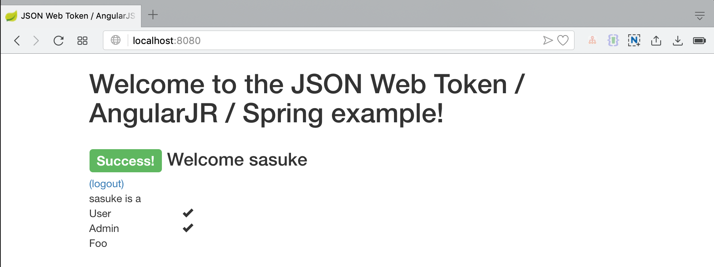

# JSON Web Token / AngularJS / Spring Boot example

[Blog post on this subject](http://niels.nu/blog/2015/json-web-tokens.html)

This is an example project where a Spring REST API is secured using JSON Web Tokens. Since there are relatively few examples available for Java and there are some pitfalls (such as most sources pointing to a Java lib that's not straightforward to use) I decided to extract my proof of concept into a stand-alone example and publish it for all to see.

## JSON Web Tokens

JSON Web Tokens have a few benefits over just sending a 'regular' token over the line. The more common approach to securing a REST API (outside of normal HTTP Basic Auth) is to send a random string as a token on succesful login from the server to the client. The client then sends this token on every request, and the server does an internal lookup on that token (in for example a REDIS cache or a simple Hashtable) to retrieve the corresponding user data.

With JSON Web Tokens the latter part isn't needed: the token itself contains a representation of the 'claims' of client: this can be just a username, but can also be extended to include any data you wish. This token is transmitted from the client on every request. The contents of the token are encrypted and a hash is added to prevent tampering: this way the content is secure: the server is the one signing and encrypting the token and is also the only one who had the key needed to decrypt the token. 

In this example this key is fixed ("secretkey") but in a real life situations the secret key would simply be an array of bytes randomly generated on application startup. This has the added benefit that any tokens get automatically invalidated when you restart the service. If this behaviour is undesired you can persist the keys in for example REDIS.

## Server side: Spring Boot

I like using Spring (Boot) to create RESTful services. On the server side, the JWT signing is done in the user/login REST call in UserController. It contains a tiny 'database' of 2 users, one of which has the 'admin' rights. The verification is done in a Filter (JwtFilter): it filters every request that matches "/api/*". If a correct token isn't found an exception is thrown. If a correct token is found, the claims object is added to the Http Request object and can be used in any REST endpoint (as shown in ApiController).

The heavy lifting for JWT signing is done by the more than excellent [Java JWT](https://github.com/jwtk/jjwt) library.

## Client Side: AngularJS

The simple Angular app shows a login page. On successful login it checks with 'the API' which roles are available (of which the 'foo' role doesn't exist for any user).

## Running

It is a standard Maven project and can be imported into your favorite IDE. You run the example by starting the WebApplication class (it has a main) and navigating to http://localhost:8080/. If everything is correct you should see a "Welcome to the JSON Web Token / AngularJR / Spring example!" message and a login form.

### Screenshot

Login Page

Naruto Page

Hendi Page

Sasuke Page

